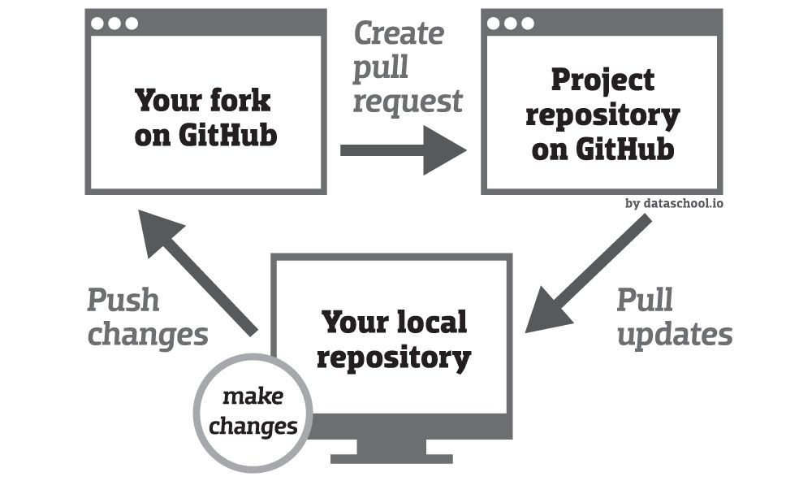

# 🎉CP-DSA-Questions🎉

This is a repository *entirely dedicated* to all kind of questions ranging from basic DSA to CP. It aims to provide a solution to different questions. These questions are from various coding platforms like Hackerrank, HackerEarth, Leetcode, Codechef, Codeforces, InterviewBit, AtCoder. It also consist [450 DSA Sheet](https://450dsa.com/).
## 🎓Platforms To Be Considered 🎓

- HackerRank
- HackerEarth
- Leetcode
- Codechef
- Codeforces 
- InterviewBit
- AtCoder
- GFG

## Languages To Be Considered 

- C++
- C
- Python
- Java
- JavaScript
--- 

# 🎇How To Contribute 🎇

***Read [contribution guidelines](./Contributing.md)***

<p align="center"></p>

To start contributing, follow the below guidelines:

🌟. Star🌟 the repo to appreciate the work.

0. Take a look at the existing issues or create your own issues. Wait for the Issue to be assigned to you after which you can start working on it.

1. Find a question you can solve from any of these platforms.

2. Open an issue.

3. Get it assigned.

4. Work on it i.e 
   * Solve that question by yourself.
   * Add it to your forked repo, if the folder doesn't exist create it first and then add your code.

5. Make a pull request. 

6. Wait for it to be merged 

7. And WOAHLAAAAAAAA! 🎉 You contributed to this project.


## 🎏 Steps For Making A Pull Request 🎏

**1.** **Fork** [this]() repository.

**2.** **Clone** your forked copy of the project.

```
git clone 
```

**3.** **Navigate** to the project directory :file_folder: .

```
cd CP-DSA-Questions
```

**4.** **Add a reference(remote)** to the original repository to get all the changes from the remote.

```
git remote add upstream 
```

**5.** **Check the remote** for this repository.

```
git remote -v
```

**6.**  Always take a pull from the upstream repository to your master branch to keep it at par with the main project **(updated repository)**.

```
git pull upstream main
```

**7.** **Create a new branch**.

```
git checkout -b <your_branch_name>
```

**8.** **Perform** your changes to the code base.

**9.** **Track your changes**.

```
git add . 
```

**10.** **Commit** your changes.

```
git commit -m "Relevant message"
```

**11.** **Push** the committed changes in your branch to your remote repo.

```
git push -u origin <your_branch_name>
```

**12.** To create a pull request, click on `Compare and pull requests`.

**13.** Add appropriate title and description to your pull request explaining your changes and efforts.

**14.** Click on `Create Pull Request`.


**15** 🎉 WOAHHHH!!!! 🎉 you made a pull request, Wait for it to get approved and merged 🤗🤗

<p align="center"></p>


# 🎉🎉🎉🎉🎉🎉 ___HAPPY CONTRIBUTING!___ 🎉🎉🎉🎉🎉🎉
Made with ❤️ By Mohit 


<!-- QUOTE:START -->
<p align="center"><br><i>But at any rate, the point is that God is what nobody admits to being, and everybody really is.</i><br><i>– Alan Watts.</i><br></p>
<!-- QUOTE:END -->
